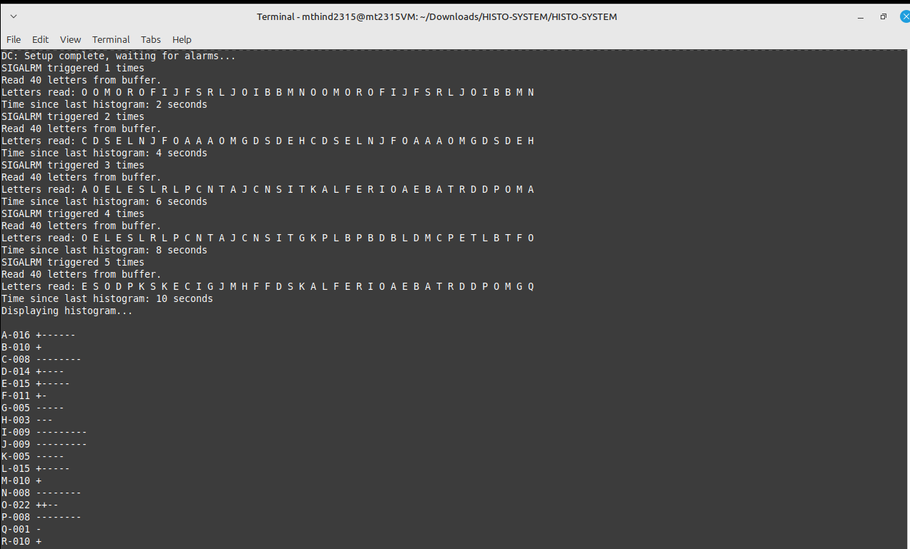
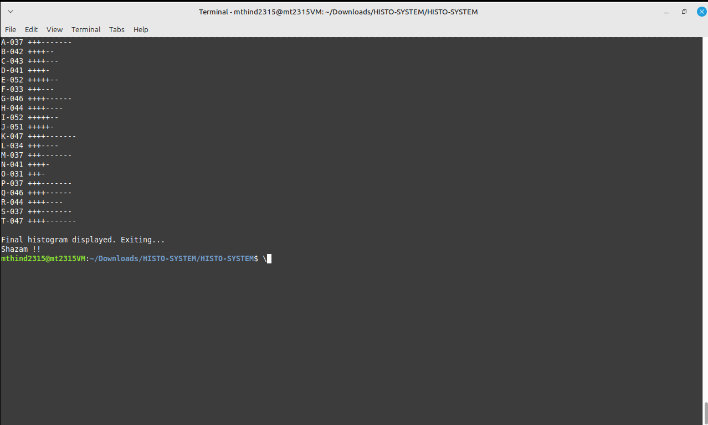

# HISTOGRAM-SYSTEM

## Overview

This project implements an inter-process communication system involving three programs:

- **DP-1** (Data Producer 1)
- **DP-2** (Data Producer 2)
- **DC** (Data Consumer)

- The producers write random letters (A–T) to shared memory using a circular buffer structure.
- The consumer reads those letters and prints a live-updating histogram to the console every 10 seconds, showing the frequency of each letter.
- The system updates data every 2 seconds and visually represents the frequency of letters from A to T.
- Histogram shows frequency of letters A–T using:
   `-` for units
   `+` for tens
   `*` for hundreds

## Components

`DP-1` - Initializes shared memory and semaphore, writes 20 letters every 2 seconds 
`DP-2` - Writes 1 letter every 1/20 second
`DC` - Reads data every 2 seconds, displays histogram every 10 seconds, handles cleanup on `SIGINT` 

## Compilation

- From the root directory:
make all

## How to Run

1. **Open Terminal 1 (in root directory): Start the system**
./DP-1/bin/DP-1
This:
- Initializes shared memory and semaphore
- Forks and starts `DP-2`, which in turn starts `DC`

2. **Open Terminal 2 (could be anywhere): Send SIGINT to DC**
- Get DC's PID:
pgrep -af DC

- Send SIGINT:
kill -SIGINT <DC_PID>

DC will:
- Stop both producers
- Drain the buffer
- Print final histogram
- Show `Shazam !!` and exit

## Output Sample
**On Start**

**On Shutdown**

## 📑 Notes

- `DP-1` is responsible for creating shared memory and the semaphore
- `DP-2` and `DC` only attach to them
- Final output always includes `Shazam !!` after graceful shutdown
- On receiving SIGINT (e.g., via Ctrl+C), the Data Consumer (DC) process initiates a graceful shutdown. This includes reading any remaining letters from the buffer and displaying the final histogram.
As a result, there may be a slight delay (up to a few seconds) before the program exits and displays the message Shazam !!. This behavior is expected and ensures all data is properly processed and displayed before termination.

